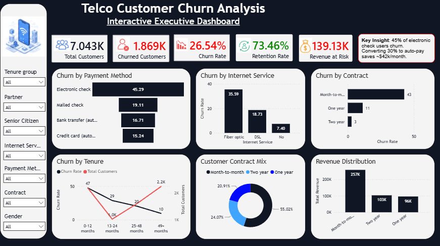

# 📡 Telco Customer Churn Analysis

&gt; Interactive executive dashboard identifying churn drivers and quantifying revenue at risk for a telecom provider.

---

## 🎯 Business Problem

A telecom company is experiencing a **26.5% customer churn rate**, resulting in **$139.1K in monthly revenue at risk**. This project analyzes 7,043 customer records to identify key churn drivers and recommend actionable retention strategies.

---

## 🔑 Key Findings

| Metric | Value |
|--------|-------|
| Total Customers | 7,043 |
| Churn Rate | 26.54% |
| Monthly Revenue at Risk | $139,130 |
| Retention Rate | 73.46% |

### Top Churn Drivers

1. **Contract Type**: Month-to-month customers churn at **43%** vs. 3% for two-year contracts
2. **Payment Method**: Electronic check users churn at **45%** — highest of any method
3. **Internet Service**: Fiber optic customers without security bundles churn at **42%**
4. **Tenure**: First 12 months are critical — **47% churn rate** among new customers

---

## 🛠️ Tech Stack

| Tool | Purpose |
|------|---------|
| **Excel** | Data cleaning, type conversion, missing value handling |
| **Databricks SQL** | Analytical queries, customer segmentation, feature engineering |
| **Power BI** | Interactive dashboard with cross-filtering and drill-through |

---

## 📊 Dashboard Features

- **6 KPI Cards** with dynamic metrics and trend indicators
- **6 Interactive Charts** (bar, line, donut, gauge, dual-axis)
- **Cross-Filtering Slicers** for real-time segment analysis
- **Revenue at Risk Quantification** by customer segment

---

## 🚀 Business Recommendations

| Priority | Action | Potential Impact |
|----------|--------|----------------|
| 🔴 High | Convert month-to-month customers to annual contracts | 30% churn reduction |
| 🔴 High | Incentivize electronic check users to switch to auto-pay | 45% → 15% churn rate |
| 🟡 Medium | Bundle online security with fiber plans | 42% → 20% churn rate |
| 🟡 Medium | Enhanced onboarding for first-year customers | 47% → 30% churn rate |

---

## 📁 Repository Structure
telco-customer-churn-analysis/
├── README.md
├── .gitignore
├── data/
│   └── README.md              (explain data source, don't upload CSV)
├── excel/
│   ├── Telco_Cleaning_Log.xlsx
│   └── cleaning_steps.md
├── sql/
│   ├── 01_setup_and_validation.sql
│   ├── 02_kpi_summary.sql
│   ├── 03_churn_drivers.sql
│   ├── 04_revenue_risk.sql
│   └── 05_create_analysis_table.sql
├── powerbi/
│   ├── Telco_Churn_Dashboard.pbix
│   └── README.md
└── docs/
    ├── business_recommendations.md
    └── dashboard_screenshots/
        ├── overview.png
        └── detail.png

---

## 🖼️ Dashboard

---

## 👤 Author

**[Your Name]** — Data Analyst

[LinkedIn](https://linkedin.com/in/yourprofile)

---

## 📄 License

This project uses the IBM Telco Customer Churn dataset for educational purposes.
